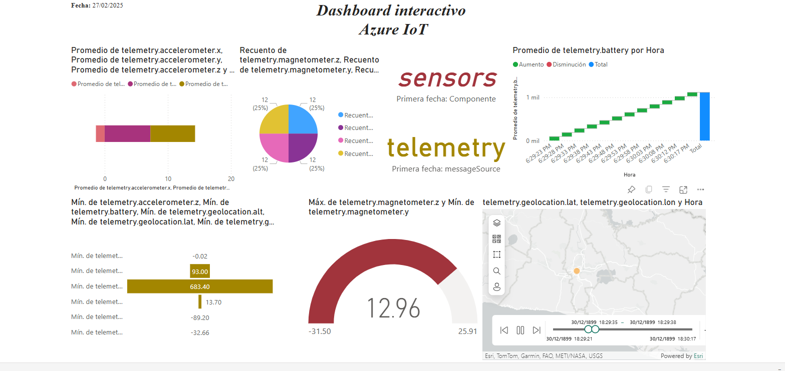
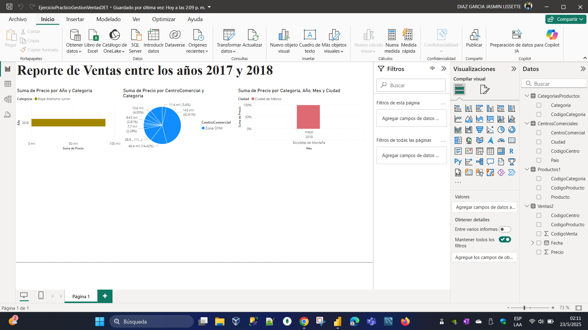
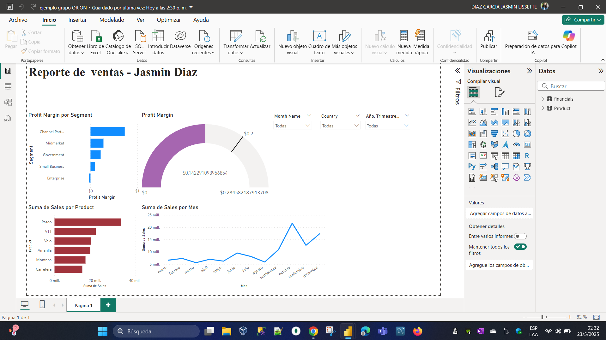
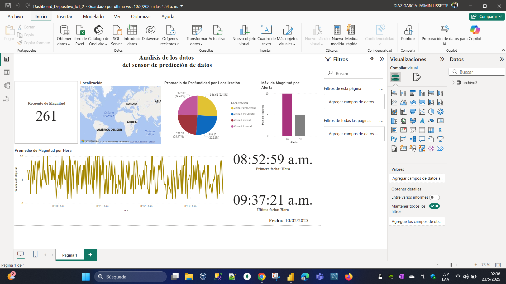
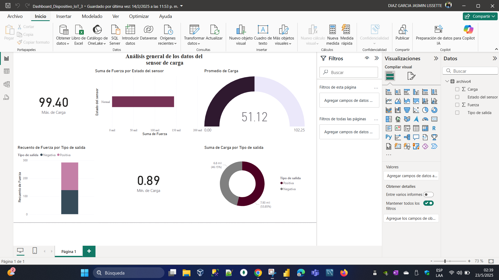
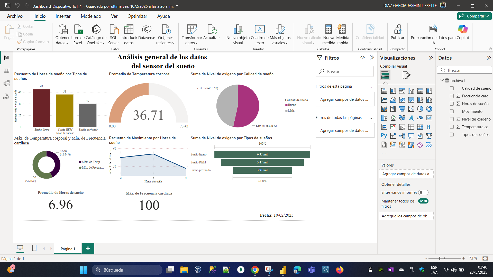
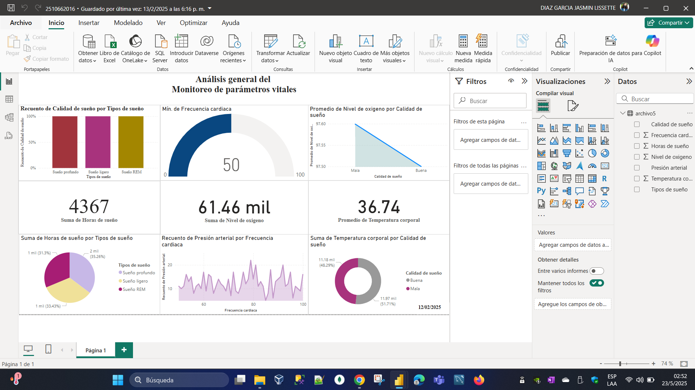

# Dashboards
📊 Análisis 1: Dashboard de Monitoreo IoT
Este panel muestra el funcionamiento de sensores industriales conectados, incluyendo métricas clave como telemetría, porcentaje de uso y ubicación geográfica. Ideal para aplicaciones de mantenimiento predictivo y eficiencia operativa.

📊 Análisis 2: Reporte de Ventas por Año
Visualización comparativa de las ventas entre los años 2017 y 2018. Se presentan los ingresos totales, el número de órdenes y devoluciones, lo que permite analizar el rendimiento por año.

📊 Análisis 3: Reporte de Ventas por Región
Se detalla el rendimiento de ventas por regiones, permitiendo identificar zonas geográficas con mejor comportamiento comercial. Incluye KPIs de ventas, tendencias y filtros interactivos.

📊 Análisis 4: Reporte de Actividad por Hora
Muestra los picos de actividad a lo largo del día, junto con datos de ubicación y rendimiento. Esta vista ayuda a identificar horarios con mayor flujo de operaciones o ventas.

📊 Análisis 5: Dashboard de sensor de Rendimiento
Panel enfocado en indicadores clave como ingresos, márgenes y crecimiento. Se destacan con visuales circulares para una rápida evaluación del rendimiento general.

📊 Análisis 6: Análisis de Producto y Categoría
Este análisis muestra los productos y categorías más vendidos, junto con filtros de tiempo y métricas como total de ventas y unidades. Ideal para decisiones de inventario y marketing.

📊 Análisis 7: Dashboard Ejecutivo de Ventas
Vista integral de métricas ejecutivas como ingresos, total de órdenes y tasa de retorno. Permite una evaluación general rápida del estado del negocio.

## 👩‍💻 Autora

Jasmin Díaz - Estudiante de Ingeniería en Sistemas - UTEC
